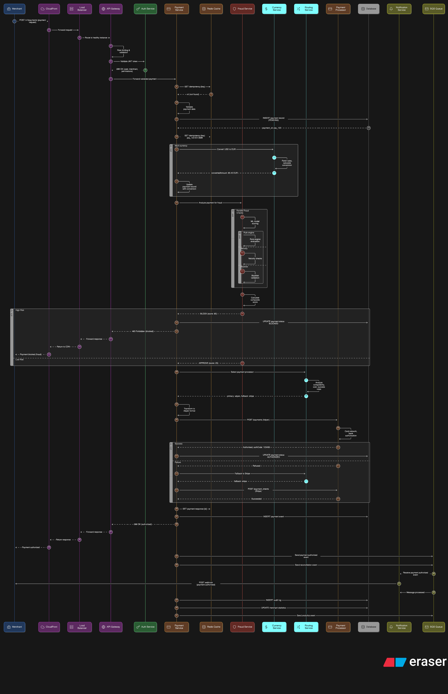

# 💳 Payment Service Provider

> **A distributed, high-volume payment processing platform** built with Java 17,
> Spring Boot 3.x, and Apache Kafka — implementing the full payment lifecycle from
> merchant onboarding through transaction processing, currency conversion, and
> reconciliation. Designed around production-grade patterns: idempotent processing,
> Saga-based distributed consistency, and event-driven service decoupling.

[](https://openjdk.org/projects/jdk/17/)
[](https://spring.io/projects/spring-boot)
[](https://kafka.apache.org/)
[](https://www.docker.com/)
[](LICENSE)

---

## What Is This?

A **Payment Service Provider (PSP)** is the infrastructure layer that sits between
a merchant and the global payment networks — accepting payment requests, routing
them through currency conversion, executing the transaction, and notifying all
parties of the outcome.

This project implements that infrastructure as a set of independently deployable
microservices, built with the same architectural patterns used in production
fintech systems at companies like Stripe, Razorpay, and Adyen.

**Core capabilities implemented:**
- Merchant onboarding and API key management
- Payment initiation with idempotent transaction processing
- Multi-currency support with exchange rate management
- Event-driven payment lifecycle (initiated → processed → settled → notified)
- Shared domain event contracts across all services

---

## Architecture Overview

```
  Merchant / Client App
          │
          ▼
  ┌───────────────────┐
  │   Payment Service  │  ◀── Core domain — orchestrates the payment flow
  │  (Saga coordinator)│
  └────────┬──────────┘
           │  Publishes domain events to Kafka
           ▼
  ┌─────────────────────────────────────────┐
  │              Apache Kafka               │
  │  payment.initiated  │  payment.processed │
  │  payment.failed     │  payment.settled   │
  └──────┬──────────────┬────────────────────┘
         │              │
         ▼              ▼
  ┌─────────────┐  ┌──────────────────┐
  │  Merchant   │  │  Currency Service │
  │  Service    │  │  FX rates · conv  │
  └─────────────┘  └──────────────────┘

  ┌─────────────┐
  │   Common    │  ◀── Shared DTOs, Kafka event contracts, utilities
  └─────────────┘
```

### Payment Flow Sequence



The sequence above shows the happy-path flow: a merchant initiates a payment →
Payment Service validates and persists the transaction → Currency Service converts
if cross-currency → Kafka event published → downstream consumers (notifications,
reconciliation) react asynchronously.

---

## Services

### 💳 Payment Service ✅ `Completed`
The core domain service — owns the payment transaction lifecycle end to end.

**Responsibilities:**
- Accept payment initiation requests with idempotency key validation
- Persist transaction state with ACID guarantees
- Orchestrate the payment flow via Saga pattern
- Publish `payment.initiated`, `payment.processed`, `payment.failed` events to Kafka
- Expose transaction status and history APIs

**Key design decisions:**
- **Idempotency keys** on every payment request — safe to retry without double-charging
- **Saga choreography** for distributed consistency across service boundaries
- **Outbox pattern** to prevent dual-write between database and Kafka
- **Optimistic locking** on transaction records to prevent lost updates under concurrency

### 🏪 Merchant Service 🚧 `In Progress`
Manages merchant identity, API credentials, and configuration.

**Responsibilities:**
- Merchant onboarding and KYC status tracking
- API key issuance and rotation
- Merchant-level payment configuration (supported currencies, limits)
- Webhook endpoint registration for payment event delivery

### 💱 Currency Service ✅ `Completed`
Handles foreign exchange rate management and currency conversion.

**Responsibilities:**
- Exchange rate storage and retrieval by currency pair
- Real-time conversion calculations for cross-currency payments
- Rate refresh scheduling (configurable interval)
- Audit trail of rates applied to each transaction

### 📦 Common Module ✅ `Completed`
Shared library providing cross-service contracts and utilities.

**Contains:**
- Kafka domain event schemas (shared between producers and consumers)
- Common API response envelope and error codes
- Shared DTOs and validation annotations
- Base exception hierarchy

---

## Key Technical Decisions

### Why Idempotency Keys?
Payment APIs are called over unreliable networks. A client may retry a request
after a timeout — not knowing if the original succeeded. Without idempotency,
this causes duplicate charges. Every payment request carries a client-generated
idempotency key; the Payment Service stores this key and returns the original
response on duplicate requests — preventing double-processing entirely.

### Why Saga Pattern Instead of Distributed Transactions?
A payment touches multiple services (payment, merchant validation, currency
conversion). Using 2-Phase Commit (2PC) would tightly couple service availability
and create deadlock risk under load. The Saga pattern breaks the transaction into
local steps — each service does its work and publishes an event. If any step
fails, compensating transactions roll back prior steps. This gives us consistency
without distributed locks.

### Why Kafka for Inter-Service Communication?
All payment lifecycle events are published to Kafka topics rather than calling
services directly. This decouples producers from consumers — the Payment Service
doesn't need to know about the notification or reconciliation services. Kafka's
durable log also means events can be replayed for debugging, re-processing after
failures, or feeding analytics pipelines.

### Why the Outbox Pattern?
A common mistake in event-driven systems is writing to the database *and*
publishing to Kafka in the same logical operation (dual-write). If the database
write succeeds but Kafka publish fails, the system is inconsistent. The outbox
pattern solves this by writing the event to a local `outbox` table inside the
same database transaction, then having a separate process reliably publish it to
Kafka — guaranteeing exactly-once event delivery.

---

## Tech Stack

| Concern | Technology |
|---|---|
| Language | Java 17 |
| Framework | Spring Boot 3.x, Spring Cloud |
| Messaging | Apache Kafka |
| Database | PostgreSQL |
| Containerisation | Docker, Docker Compose |
| Build | Maven (multi-module) |
| API Style | REST (Spring MVC) |

---

## Getting Started

### Prerequisites
- Java 17+
- Docker & Docker Compose
- Maven 3.6+

### Run Locally

```bash
# Clone the repository
git clone https://github.com/Eomaxl/PaymentServiceProvider.git
cd PaymentServiceProvider

# Start infrastructure (Kafka, PostgreSQL, Zookeeper)
docker-compose up -d

# Build all modules
mvn clean install -DskipTests

# Start Payment Service
cd payment-service
mvn spring-boot:run

# Start Currency Service (separate terminal)
cd ../currency-service
mvn spring-boot:run

# Start Merchant Service (separate terminal)
cd ../merchant-service
mvn spring-boot:run
```

### API Quick Reference

```bash
# Initiate a payment
POST /api/v1/payments
Content-Type: application/json
Idempotency-Key: <uuid>

{
  "merchantId": "merchant_123",
  "amount": 1500.00,
  "currency": "USD",
  "targetCurrency": "INR",
  "description": "Order #4521"
}

# Check payment status
GET /api/v1/payments/{transactionId}

# Get exchange rate
GET /api/v1/currencies/rate?from=USD&to=INR

# Register a merchant
POST /api/v1/merchants
{
  "name": "Acme Corp",
  "email": "payments@acme.com",
  "webhookUrl": "https://acme.com/webhooks/payment"
}
```

---

## Project Structure

```
PaymentServiceProvider/
├── payment-service/        # Core — transaction lifecycle, Saga orchestration
├── merchant-service/       # Merchant onboarding, API key management
├── currency-service/       # FX rates, currency conversion
├── Common/                 # Shared DTOs, Kafka contracts, utilities
├── payment-flow-sequence.png  # Architecture sequence diagram
└── pom.xml                 # Maven multi-module parent
```

---

## Design Patterns Used

| Pattern | Where Applied |
|---|---|
| **Saga (Choreography)** | Distributed payment transaction across services |
| **Idempotent Consumer** | Payment Service deduplication on retry |
| **Outbox Pattern** | Reliable dual-write prevention (DB + Kafka) |
| **Event-Driven Architecture** | Kafka topics as service integration layer |
| **Shared Kernel** | `Common` module for cross-service contracts |
| **Domain Events** | Payment lifecycle events as first-class objects |

---

## Roadmap

The following services are planned to complete the full PSP lifecycle:

- [ ] **Fraud Service** — ML-based real-time fraud scoring integrated into payment flow
- [ ] **Routing Service** — Intelligent payment network selection (cost, success rate)
- [ ] **Notification Service** — Webhook delivery to merchants on payment events
- [ ] **Reconciliation Service** — End-of-day settlement and ledger balancing
- [ ] **Audit Service** — Immutable compliance event log
- [ ] **API Gateway** — Single entry point with rate limiting and auth

---

## Related Projects

- [**NimbusBankingSystem**](https://github.com/Eomaxl/NimbusBankingSystem) — Core banking platform with account management, risk scoring, and audit compliance
- [**Real-Time-Chat-Platform**](https://github.com/Eomaxl/Real-Time-Chat-Platform) — High-throughput messaging backend with WebSocket and WebRTC signalling
- [**rag-gtm-system**](https://github.com/Eomaxl/rag-gtm-system) — AI-powered RAG system for sales teams using LangChain and Llama 3.2

---

## Author

**Sourav Snigdha Mansingh**
Senior Backend Engineer | Java · Kafka · Distributed Systems · Python/AI

🔗 [LinkedIn](https://www.linkedin.com/in/sourav-snigdha-mansingh/)
🐙 [GitHub](https://github.com/Eomaxl)
✍️ [Medium](https://souravsnigdha.medium.com/)

*Open to Senior Backend Engineer and Staff Engineer roles — Bengaluru, Remote India, or Remote Global.*

---

> ⭐ If this project helped you understand distributed payment systems or
> prepare for system design interviews, a star is appreciated!

